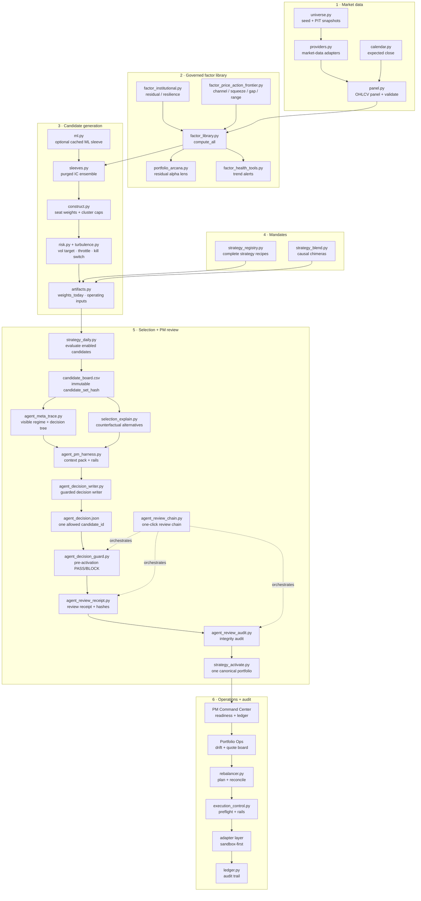
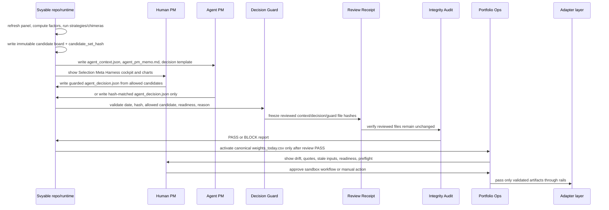
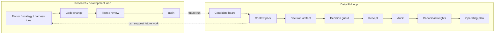

# Svyable Strategies

Svyable Strategies is a daily cross-sectional alpha research, portfolio-management, and operations platform derived from the strongest price-action ideas in [`Svyable/Q23_QUANT_SYSTEM_2`](https://github.com/Svyable/Q23_QUANT_SYSTEM_2).

The objective is effective systematic trading research: differentiated alpha sources, controlled beta participation, robust volatility and turbulence avoidance, honest costs, observable decisions, and one safe operating boundary.

This README is the canonical project narrative and operating guide. Detailed institutional positioning and evidence standards are in [`docs/institutional_alpha_platform.md`](docs/institutional_alpha_platform.md). The human/agent operating contract is in [`docs/agentic_operating_model.md`](docs/agentic_operating_model.md).

## Current truth

Svyable is **paper-operational research infrastructure**. It is not yet a live-capital track record.

Implemented:

- Vendor-agnostic daily OHLCV panel with validation, caching, and point-in-time processing discipline.
- Price-action, residual, defensive, reversal, liquidity, behavioral, frontier tape-reading, and clearly labeled daily-flow proxy factors.
- Portfolio Arcana analytics for market-model residual alpha, idiosyncratic volatility, idio information ratio, factor exposures, and symbol-level residual contributors.
- Agent PM context-pack harness that converts the immutable candidate board into `agent_context.json`, `agent_pm_memo.md`, and a hash-matched decision template while forbidding same-cycle repo self-modification.
- Selection Meta Harness cockpit with operator stepper, guarded decision writer, one-click review chain, activation readiness gates, candidate utility decomposition chart, candidate ranking chart, artifact inventory, downloads, guard, receipt, audit, counterfactuals, regime proxy, and weight provenance.
- Visible meta harness: regime proxy, PASS/WARN/BLOCK decision tree, score decomposition, deterministic weight provenance, counterfactual alternatives, and decision readiness.
- Guarded decision writer that fills the latest board date/hash, restricts choices to allowed candidate IDs, validates confidence/reason, and immediately runs the guard.
- Pre-activation decision guard that validates `agent_decision.json` against the latest context, allowed candidates, hash, confidence, reason, and artifact readiness before activation.
- Agent review receipt and integrity audit that freeze reviewed file hashes and verify the context/memo/decision/guard files remain unchanged before activation.
- One-click review chain runner for context presence/refresh, guard, receipt, and audit without creating weights or operating artifacts.
- Purged causal IC weighting with uncertainty, hit-rate, coverage, and redundancy controls.
- Complete strategy registry: every strategy owns factors, construction, concentration, risk, cost, cadence, and maturity.
- Svyable Frontier Price Action strategy candidate built from channel pressure, compression thrust, gap continuation, range participation, and range rejection plus institutional trend and resilience controls.
- Correlation-cluster caps, score/equal/HRP/blended seat weighting, no-trade bands, and ADV-aware operating inputs.
- Volatility targeting, drawdown controls, structural turbulence, absorption ratio, breadth, panic state, and own-book kill switch.
- Fixed, inverse-volatility, and alpha/risk chimera portfolios with causal component-weight histories.
- Deterministic, manual, and two-phase agent selection with immutable candidate hashes and explicit user approval.
- Institutional scorecards covering alpha, beta, capture, tails, risk, turnover, costs, and beta-adjusted residual return.
- Streamlit PM Command Center, Agent Lab, Selection Meta Harness, Analytics/Arcana, Factor Governance, Factor Health, Portfolio Ops, and audit surfaces.
- Community SDK adapter with sandbox preflight, polling, cancellation, fills, slippage, delayed-fill recovery, reconciliation, and audit.

Not true yet:

- No live-capital performance is claimed.
- Bulk production action from Streamlit remains disabled.
- The strategy and chimera registry has not yet accumulated a sustained sandbox operating record.
- Seed-universe historical tests remain survivorship-biased unless explicitly labeled point-in-time.
- Institutional metrics are engineering evidence, not promised future returns.

## End-to-end operating flow



## Agentic rails: repo ↔ agent ↔ operations



The agent does **not** generate weights or quantities. It selects a legal candidate from an immutable board. Only activated canonical artifacts feed the operating plan.

## Two loops that must stay separate



Same-cycle repository self-improvement is forbidden. The daily loop must operate from already-approved code.

## Core artifacts

| Artifact | Produced by | Consumed by | Purpose |
| --- | --- | --- | --- |
| `candidate_board.csv` | `strategy_selector.py` | human, agent, harness | Immutable ranked candidate set with hash |
| `agent_context.json` | `agent_pm_harness.py` | agent / GUI | Machine-readable board, rails, trace, readiness |
| `agent_pm_memo.md` | `agent_pm_harness.py` | human PM | Human-readable decision memo |
| `agent_decision_template.json` | `agent_pm_harness.py` | agent / human | Legal output schema |
| `agent_decision.json` | writer / agent / human | guard + activation | Hash-matched candidate choice |
| `latest_agent_decision_guard.json` | `agent_decision_guard.py` | human / automation | PASS/BLOCK validation report |
| `latest_agent_review_receipt.json/md` | `agent_review_receipt.py` | human / audit | Frozen review packet with file hashes |
| `latest_agent_review_audit.json` | `agent_review_audit.py` | human / automation | Receipt integrity PASS/BLOCK report |
| `latest_agent_review_chain.json` | `agent_review_chain.py` | human / automation | One-click review-chain report |
| `weights_today.csv` | activation / pipeline | Portfolio Ops | Canonical target weights |
| `execution_inputs.csv` | pipeline | rebalancer / preflight | Prices, ADV, liquidity flags |
| `ledger.db` | ops layers | dashboards / audit | Runs, warnings, actions, fills, drift |

## Install

From `engine/`:

```bash
python -m pip install -r requirements.txt
```

For package installs, `pyproject.toml` exposes optional groups:

```bash
python -m pip install -e '.[all,dev]'
```

## Daily PM commands

```bash
python -m svyable.strategy_daily --evaluate-only
python -m svyable.agent_pm_harness --out outputs
python -m svyable.agent_decision_writer --out outputs --candidate <allowed_candidate_id> --confidence 0.60 --reason "Reviewed meta harness and approved this candidate."
python -m svyable.agent_review_chain --out outputs
python -m svyable.strategy_activate --out outputs
```

Installed script equivalents:

```bash
svyable-strategy-daily --evaluate-only
svyable-agent-pack --out outputs
svyable-agent-decide --out outputs --candidate <allowed_candidate_id> --confidence 0.60 --reason "Reviewed meta harness and approved this candidate."
svyable-agent-review-chain --out outputs
svyable-strategy-activate --out outputs
```

## Human PM checklist

1. Generate the daily candidate board in agent/evaluate-only mode.
2. Open Streamlit → **Selection Meta Harness**.
3. Confirm decision readiness is `PASS` and review the activation-readiness gates.
4. Review the utility decomposition chart, candidate ranking chart, visible regime proxy, decision tree, blocked candidates, counterfactual alternatives, and deterministic weight provenance.
5. Use the guarded decision writer to write `strategy_selection/agent_decision.json` from an allowed `candidate_id` and matching hash.
6. Run the one-click review chain and resolve any `BLOCK` report before activation.
7. Activate canonical weights.
8. Use Portfolio Ops for quote sanity, drift review, preflight, sandbox workflow, reconciliation, and audit.

## Repository map

| Layer | Important modules |
| --- | --- |
| Data | `providers.py`, `panel.py`, `calendar.py`, `universe.py` |
| Factors | `factor_library.py`, `factor_institutional.py`, `factor_price_action_frontier.py`, `factor_health_tools.py` |
| Portfolio intelligence | `portfolio_arcana.py`, `selection_explain.py`, `agent_meta_trace.py` |
| Strategy frontier | `strategy_registry.py`, `strategy_blend.py`, `strategy_daily.py`, `strategy_selector.py` |
| Agent PM harness | `agent_pm_harness.py`, `agent_decision_writer.py`, `agent_decision_guard.py`, `agent_review_receipt.py`, `agent_review_audit.py`, `agent_review_chain.py`, `agent_chart_model.py`, `agent_gui_model.py`, `strategy_activate.py`, `dashboard_agent_intel.py`, `pages/8_Agent_Meta_Harness.py` |
| Operations | `dashboard_command_center.py`, `dashboard_portfolio_ops.py`, `dashboard_readiness.py`, `dashboard_live_market.py` |
| Execution/audit | `rebalancer.py`, `execution_control.py`, `submission_guard.py`, adapter modules, `ledger.py` |
| Tests | `engine/tests/test_agent_pm_harness.py`, `test_agent_meta_trace.py`, `test_selection_explain.py`, `test_agent_decision_guard.py`, `test_agent_decision_writer.py`, `test_agent_review_receipt.py`, `test_agent_review_audit.py`, `test_agent_review_chain.py`, `test_agent_chart_model.py`, GUI/factor/strategy/readiness tests |

## Safety and truthfulness

Svyable is designed so the agent can improve review quality without bypassing human and operating rails. The visible meta harness is an auditable rationale tree, not hidden chain-of-thought. It explains what the artifacts imply; it does not claim certainty, future returns, or live-capital performance.
