# Svyable Strategies

Svyable Strategies is a daily cross-sectional alpha research, portfolio-management, and broker-operations platform derived from the strongest price-action ideas in [`Svyable/Q23_QUANT_SYSTEM_2`](https://github.com/Svyable/Q23_QUANT_SYSTEM_2).

```text
validated market panel
  -> governed factor library
  -> complete registered strategy portfolios
  -> causal chimera portfolios
  -> immutable candidate board
  -> deterministic / agent PM selection
  -> user-approved canonical portfolio
  -> sandbox execution and reconciliation
```

The objective is effective systematic trading, not complexity for its own sake: differentiated alpha sources, controlled beta participation, robust volatility and turbulence avoidance, honest transaction costs, observable decisions, and one safe execution boundary.

This README is the canonical project narrative and operating guide. Detailed institutional positioning and evidence standards are in [`docs/institutional_alpha_platform.md`](docs/institutional_alpha_platform.md).

## Current truth

Svyable is **paper-operational research and execution infrastructure**. It is not yet a live-capital track record.

Implemented:

- Vendor-agnostic daily OHLCV panel with validation, caching, and point-in-time processing discipline.
- Price-action, residual, defensive, reversal, liquidity, behavioral, frontier tape-reading, and clearly labeled daily-flow proxy factors.
- Portfolio Arcana analytics for market-model residual alpha, idiosyncratic volatility, idio information ratio, factor exposures, and symbol-level residual contributors.
- Agent PM context-pack harness that converts the immutable candidate board into `agent_context.json`, `agent_pm_memo.md`, and a hash-matched decision template while forbidding same-cycle repo self-modification.
- Purged causal IC weighting with uncertainty, hit-rate, coverage, and redundancy controls.
- Complete strategy registry: every strategy owns factors, construction, concentration, risk, cost, cadence, and maturity.
- Svyable Frontier Price Action strategy candidate built from channel pressure, compression thrust, gap continuation, range participation, and range rejection plus institutional trend and resilience controls.
- Correlation-cluster caps, score/equal/HRP/blended seat weighting, no-trade bands, and ADV-aware execution inputs.
- Volatility targeting, drawdown controls, structural turbulence, absorption ratio, breadth, panic state, and own-book kill switch.
- Fixed, inverse-volatility, and alpha/risk chimera portfolios with causal component-weight histories.
- Deterministic, manual, and two-phase agent selection with immutable candidate hashes and explicit user approval.
- Institutional scorecards covering alpha, beta, capture, tails, risk, turnover, costs, and beta-adjusted residual return.
- Streamlit PM Command Center, Agent Lab, Analytics/Arcana, Factor Governance, Factor Health, Portfolio Ops, and audit surfaces.
- Typed community SDK adapter with sandbox preflight, submission, polling, cancellation, fills, slippage, delayed-fill recovery, reconciliation, and audit.

Not true yet:

- No live-capital performance is claimed.
- Production bulk submission from Streamlit remains disabled.
- The strategy and chimera registry has not yet accumulated a sustained sandbox operating record.
- Seed-universe historical tests remain survivorship-biased unless explicitly labeled point-in-time.
- Institutional metrics are engineering evidence, not promised future returns.

## System architecture

Every arrow is deterministic code. Data becomes governed factors, factors become
complete strategy portfolios, portfolios become an immutable candidate board, and
only an approved canonical portfolio ever reaches the broker.

```mermaid
flowchart TB
    subgraph DATA["Market data"]
        PROV["providers.py"]
        UNI["universe.py"]
        CAL["calendar.py"]
        PANEL["panel.py<br/>OHLCV panel + validate"]
        UNI --> PROV --> PANEL
        CAL --> PANEL
    end
    subgraph FACT["Governed factor library"]
        FLIB["factor_library.py<br/>compute_all"]
        FINST["factor_institutional.py"]
        FPA["factor_price_action_frontier.py"]
        ARC["portfolio_arcana.py"]
        FMON["factor_monitor.py<br/>factor_correlation.py"]
        FINST --> FLIB
        FPA --> FLIB
        FLIB --> ARC
        FLIB --> FMON
    end
    subgraph PIPE["Per-mandate pipeline · pipeline.py"]
        ML["ml.py<br/>cached ML sleeve"]
        ENS["sleeves.py<br/>build_ensemble · purged IC"]
        CON["construct.py<br/>seat weights + cluster caps"]
        RISK["risk.py + turbulence.py<br/>vol target · throttle · kill switch"]
        ART["backtest_pnl + artifacts.py<br/>weights_today · morning_report"]
        ML --> ENS --> CON --> RISK --> ART
    end
    subgraph STRAT["Mandates"]
        REG["strategy_registry.py<br/>complete recipes"]
        BLEND["strategy_blend.py<br/>causal chimeras"]
    end
    subgraph SEL["Selection + activation"]
        DAILY["strategy_daily.py<br/>weekday runner"]
        SELECT["strategy_selector.py<br/>candidate board + hash"]
        HARNESS["agent_pm_harness.py<br/>context pack + rails"]
        ACT["strategy_activation.py<br/>one canonical portfolio"]
        DAILY --> SELECT --> HARNESS --> ACT
    end
    subgraph EXE["Execution + ledger"]
        REB["rebalancer.py<br/>plan / execute / reconcile"]
        GUARD["submission_guard.py<br/>execution_control.py"]
        BRK["brokers.py<br/>broker adapter"]
        LED["ledger.py"]
    end
```


