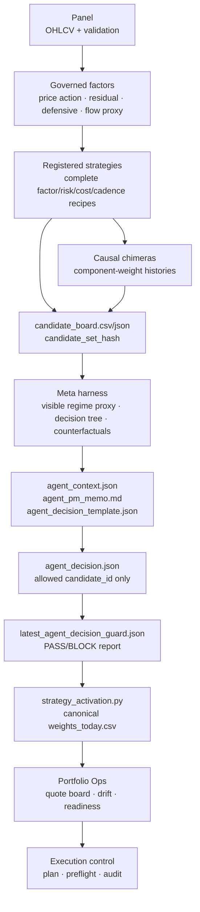
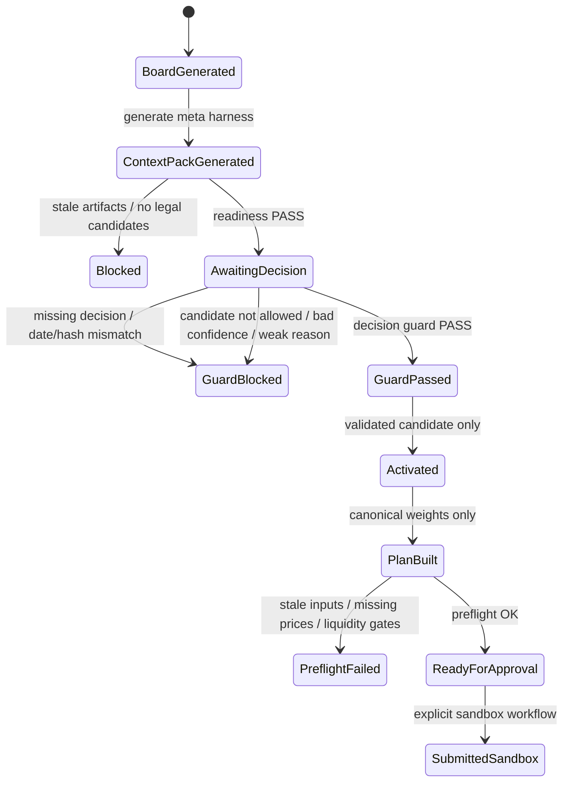
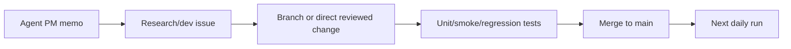

# Svyable agentic operating model

This document is the contract between Svyable's deterministic research engine, the human PM, the agent PM harness, and the operations layer.

The short rule: **the agent may choose from audited candidate portfolios; it must not invent weights, symbols, quantities, orders, or same-cycle repository changes.**

## Two loops that must stay separate

```mermaid
flowchart LR
    subgraph DEV["Research / development loop"]
        IDEA["Idea: factor, strategy, harness, GUI"]
        BRANCH["Code change"]
        TEST["Tests / review"]
        MERGE["Merge to main"]
        IDEA --> BRANCH --> TEST --> MERGE
    end

    subgraph TRADE["Daily PM loop"]
        DATA["Refresh market panel"]
        BOARD["Immutable candidate board"]
        PACK["Agent PM context pack"]
        DECIDE["Hash-matched decision artifact"]
        GUARD["Decision guard PASS/BLOCK"]
        ACT["Canonical portfolio activation"]
        PLAN["Operating plan + preflight"]
        APPROVE["Human / sandbox controls"]
        DATA --> BOARD --> PACK --> DECIDE --> GUARD --> ACT --> PLAN --> APPROVE
    end

    MERGE -. "future runs use merged code" .-> DATA
    PACK -. "may propose future improvements" .-> IDEA
```



The development loop can improve the repository. The daily loop must operate from already-approved code and already-generated artifacts. This avoids same-morning self-modification of the code path that produces the portfolio.

## Daily artifact flow



## Agent context pack files

| File | Owner | Purpose | Mutability |
| --- | --- | --- | --- |
| `candidate_board.csv` | Engine | Immutable ranked candidate set with hash | Read-only |
| `selection.json` | Engine | Deterministic or pending policy recommendation | Read-only |
| `agent_context.json` | Harness | Full machine-readable context, rails, trace, and counterfactuals | Read-only |
| `agent_pm_memo.md` | Harness | Human-readable memo for PM review | Read-only |
| `agent_decision_template.json` | Harness | Exact shape of legal decision artifact | Read-only template |
| `strategy_selection/agent_decision.json` | Agent / human | Selected allowed `candidate_id` + confidence + reason | Write-once per board |
| `latest_agent_decision_guard.json` | Guard | PASS/BLOCK validation report | Engine-written report |
| `weights_today.csv` | Engine after activation | Canonical target weights for planning | Engine-written only |

## Decision rails



The agent decision is deliberately small:

```json
{
  "as_of": "YYYY-MM-DD",
  "candidate_set_hash": "hash from current board",
  "candidate_id": "one allowed candidate_id",
  "confidence": 0.0,
  "reason": "artifact-derived rationale"
}
```

The guard validates that the artifact has the required fields, matches the latest board date/hash, chooses an allowed candidate, has confidence in `[0, 1]`, includes a substantive reason, and has a PASS-ready context.

## Visible meta trace

The meta trace is an **auditable rationale tree**, not hidden chain-of-thought. It exposes:

- Visible regime proxy: `risk_on`, `risk_off`, `chop`, `ops_stress`
- Selector gates: eligibility, rebalance threshold, cadence, hold lock, kill switch, turnover, utility
- Score decomposition: expected alpha minus cost, turnover penalty, and risk penalty
- Weight provenance: where deterministic target weights were read from, gross/net exposure, effective N, and top weights
- Counterfactual alternatives: what the focus candidate gained or lost versus competing candidates
- Decision readiness: PASS/BLOCK plus specific issues to fix before activation
- Decision guard report: final pre-activation PASS/BLOCK and warnings

## Operations-facing contract

Only activated canonical artifacts may reach the operating plan.

```mermaid
flowchart LR
    DECISION["valid decision artifact"] --> GUARD["decision guard PASS"]
    GUARD --> ACT["activate latest selection"]
    ACT --> TARGET["canonical weights_today.csv"]
    TARGET --> INPUTS["execution_inputs.csv\nprice · ADV · liquidity"]
    INPUTS --> PLAN["build_rebalance_plan"]
    PLAN --> PREFLIGHT["preflight"]
    PREFLIGHT --> AUDIT["ledger + audit"]
    AUDIT --> SUBMIT["explicit approved workflow"]
```



The agent never writes `weights_today.csv`. It never writes order quantities. It never bypasses activation, readiness, operating input checks, preflight, or human/sandbox controls.

## Operating commands

From `engine/` after installing requirements:

```bash
python -m pip install -r requirements.txt
python -m svyable.strategy_daily --evaluate-only
python -m svyable.agent_pm_harness --out outputs
python -m svyable.agent_decision_guard --out outputs --write
python -m svyable.strategy_activate --out outputs
```

Equivalent installed scripts are exposed by `pyproject.toml`:

```bash
svyable-strategy-daily --evaluate-only
svyable-agent-pack --out outputs
svyable-agent-guard --out outputs --write
svyable-strategy-activate --out outputs
```

## Human PM checklist

Before activation:

1. Open the Selection Meta Harness page.
2. Confirm decision readiness is `PASS`.
3. Review the decision tree, blocked candidates, counterfactuals, and visible regime proxy.
4. Confirm deterministic weight provenance and artifact freshness.
5. Write or approve the hash-matched decision artifact.
6. Run the decision guard and resolve any `BLOCK` report.
7. Activate canonical weights.
8. Use Portfolio Ops for quote checks, drift checks, preflight, and sandbox controls.

## Future improvement loop

The context pack may recommend research improvements, but those belong in the development loop:



Never let the agent alter the same code path during the same board/activation cycle.
